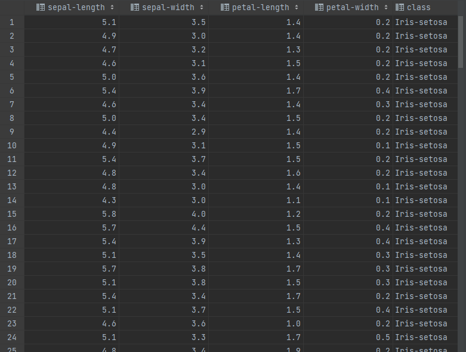
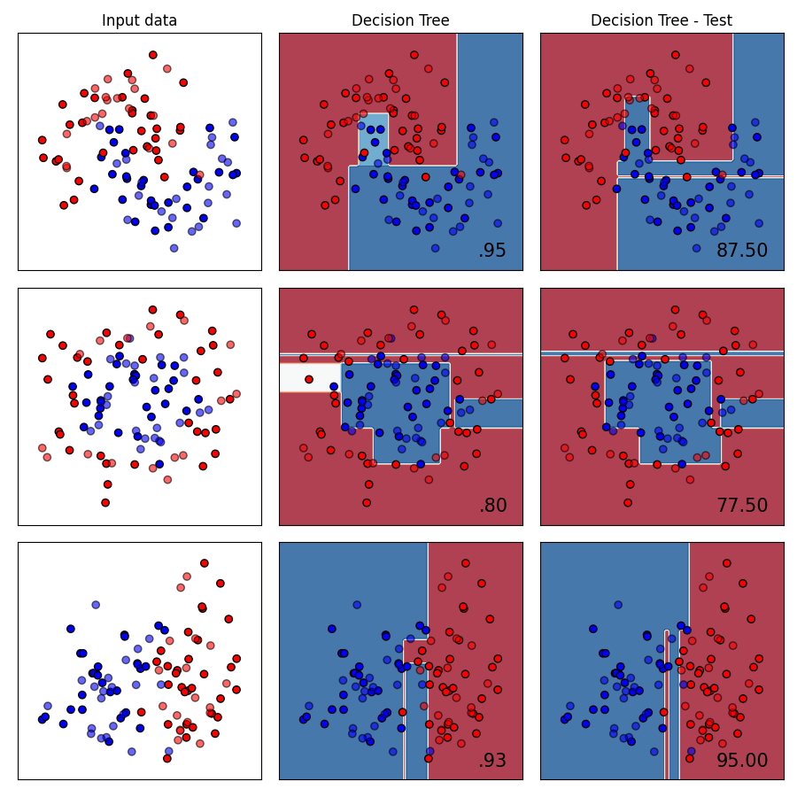

# Implementación de algoritmo Decision Tree y comparación

## Caso práctico

Dataset: https://archive.ics.uci.edu/ml/datasets/iris  
Cuenta con 4 features y 3 tipos de clasificaciones: Iris-Setosa, Iris-Versicolor, Iris-Virginica  

El dataset de Iris está balanceado, por lo que no hay necesidad de realizar un balanceo previo.


Mostraremos paso a paso la creación del árbol de decisión a través de los resultados imprimidos al ejecutar el algoritmo  
Recomendamos ver el video para tener la idea de que ocurre durante la búsqueda de la mejor división en un nodo.

El siguiente código solo nos prepara para saber interpretar los resultados del modelo resultante.
```python
    # Lectura de dataset
    df = pd.read_csv('iris.data.csv')
    # Separación de características
    X = df.iloc[:, :4]
    y = df.iloc[:, -1]
    # Conversión de clases a valores numéricos
    y = utils.label_encoder(y)
```

```text
    # Trabajaremos con 100 datos para entrenar
    # Usaremos 50 datos para testear el modelo
    # Serán los números de reemplazo a los resultados de las clases
    Clases:          ['Iris-setosa','Iris-versicolor','Iris-virginica']
    Transformación:  [0             1                  2              ]
```

### Creación y entrenamiento de árbol
Cómo se explica en el video, la creación inicia por crear la regla con el umbral que mejor división genere, en el nodo raíz.  
Entonces, el resultado de cada división posible se encuentra en este  <a href="result/Node_Root">archivo</a>
```
    El nodo raíz luego de seleccionar de las filas, su característica y el valor, tendrá como umbral esa regla:
                                                   
                                                   Nodo raiz
                                            [petal-length <3.0000]
```

Este calculo por el cual pasaran todo el dataset, generará 2 grupos, que serán el nodo hijo izquierdo y derecho

```
                                                    Nodo raiz
                                            [petal-length <3.0000]
                                 [Nodo izquierdo](31)        [Nodo derecho](69)
```
Es importante mencionar que la recursividad al crear el árbol debe ceñirse a algunas reglas de parada: Estas son:

```
    Si la regla no generó una división:
        Hacer al nodo hijo que se llevó todo el conjunto como NODO TERMINAL
    Si la profundidad del arbol no llega al valor máximo:
        CONTINUAR
    Si el hijo izquierdo tiene dentro una cantidad de datos menor a un valor MINIMO:
        Hacer al nodo hijo como NODO TERMINAL
    Caso contrario 
        Realizamos la división hecha en el nodo raíz, en este nodo
        Aumentando la profundidad en 1
    Si el hijo derecho tiene dentro una cantidad de datos menor a un valor MINIMO:    
        Hacer al nodo hijo como NODO TERMINAL    
    Caso contrario     
        Realizamos la división hecha en el nodo raíz, en este nodo
        Aumentando la profundidad en 1
```
A continuación, vemos que podemos continuar la generación de nodos

Nuevamente, adjuntaré el archivo donde se encuentra los resultados de test de división para el nodo hijo <a href="result/Node_Child_Left">izquierdo</a>
```
    Hijo izquierdo
    [sepal-length < 5.1000] División: izq: 13, der: 18
    
    
                                                      [petal-length <3.0000](100)
                                [sepal-length < 5.1000](31)             [Nodo derecho](69)
                     [Nodo izquierdo](18)   [Nodo derecho](13)
```
Debido a la generación recursiva y recorrido característico de un árbol, seguimos generando los nodos del lado izquierdo
```
    Hijo izquierdo
    [sepal-length < 5.0000] División: izq: 12, der: 6
    
                                                            [petal-length <3.0000](100)
                                      [sepal-length < 5.1000](31)                 [Nodo derecho](69)
                  [sepal-length < 5.0000](18)              [Nodo derecho](13)
          [Nodo izquierdo](12)   [Nodo derecho](6)
```
Continuamos
```
    Hijo izquierdo
    [sepal-length < 4.8000] División: izq: 8, der: 4
                                                                         [petal-length <3.0000](100)
                                                   [sepal-length < 5.1000](31)                 [Nodo derecho](69)
                               [sepal-length < 5.0000](18)              [Nodo derecho](13)
               [sepal-length < 4.8000](12)   [Nodo derecho](6)
       [Nodo izquierdo](8)   [Nodo derecho](4)
```
Continuamos
```
    Hijo izquierdo
    [sepal-length < 4.6000] División: izq: 4, der: 4
        
                                                                                [petal-length <3.0000](100)
                                                            [sepal-length < 5.1000](31)                 [Nodo derecho](69)
                                          [sepal-length < 5.0000](18)              [Nodo derecho](13)
                            [sepal-length < 4.8000](12)   [Nodo derecho](6)
               [sepal-length < 4.6000](8)   [Nodo derecho](4)
          [iris-setosa](4)  [iris-setosa](4)  
```
Es interesante revisar los resultados de sepal-length. Vealo <a href="result/First-Node-Pure.txt">aquí</a>. Notará que aquí
los nodos son puros por su resultado en Gini. Este sería nuestro primer caso donde el nodo se revisa y se le aplica la regla
de la creación del árbol.  
Continuamos con el lado derecho y aceleramos el paso
```
    Hijo derecho
    [sepal-length < 4.8000] División: izq: 0, der: 4
    
                                                                                                [petal-length <3.0000](100)
                                                                           [sepal-length < 5.1000](31)                 [Nodo derecho](69)
                                                          [sepal-length < 5.0000](18)              [Nodo derecho](13)
                                   [sepal-length < 4.8000](12)                   [Nodo derecho](6)
                  [sepal-length < 4.6000](8)       [sepal-length < 4.8000](4)
          [iris-setosa](4)  [iris-setosa](4)  [iris-setosa](4)  [iris-setosa](4) 
```

```
    Hijo derecho
    [sepal-length < 5.0000] División: izq: 0, der: 6
    
                                                                                                            [petal-length <3.0000](100)
                                                                                       [sepal-length < 5.1000](31)                 [Nodo derecho](69)
                                                           [sepal-length < 5.0000](18)                            [Nodo derecho](13)
                                   [sepal-length < 4.8000](12)                   [sepal-length < 5.0000](6)
                  [sepal-length < 4.6000](8)       [sepal-length < 4.8000](4)          [iris-setosa](6)
                        [iris-setosa](8)                 [iris-setosa](4)
```

En vista que esto se hará repetitivo, y estoy seguro que se entendió como funciona. Completaremos el árbol generado
```
                                                                                                                  [petal-length<3](100)
                                                         [sepal-length<5.1](31)                                                                                                         [petal-width<1.8](69)
                                    [sepal-length<5](18)                      [sepal-length<5.1](13)                                               [petal-length<5.6](38)                                                    [petal-length<4.9](31)
                 [sepal-length<4.8](12)                [sepal-length<5](6)      [iris-setosa](13)                           [sepal-length<5](36)                        [sepal-lenght<6.1](2)               [sepal-lenght<6](3)              [sepal-lenght<7.6](28) 
       [sepal-length<4.6](8)   [sepal-length<4.8](4)    [iris-setosa](6)                                       [sepal-width<2.5](2)            [sepal-width<2.3](34)       [iris-virginica](2)                [iris-versicolor](3)               [iris-virginica](28)
        [iris-setosa](8)       [iris-setosa](4)                                                   [iris-versicolor](1)   [iris-virginica](1)   [iris-versicolor](34)
```
Luego de esta fase recursiva. Obtendriamos nuestro árbol entrenado.


# Separamos en data de entrenamiento y test
    X_train, X_test, y_train, y_test = utils.train_test_split(X, y, test_size=0.33, random_state=42)
    X_train = utils.validate_type(X_train)
    y_train = utils.validate_type(y_train)
    # Creamos árbol
    model = DecisionTreeStatic(max_depth=5, min_size=10)
    # Entrenamos el árbol y devolvemos la raíz, para recorrerlo posteriormente
    root = model.fit(X_train, y_train)
    # Calculamos la precisión
    print('Score %s' % model.score(X_test, y_test))
    # Imprimimos cada nodo y el umbral en cada uno, así como su característica
    print_tree(root)


El algoritmo desarrollado encapsula la lógica de Decision Tree bajo el algoritmo CART y mantienen una estructura similar a los métodos ofrecidos en Scikit-learn

## Clase K-Nearest-Neighbors
Brinda 3 métodos:
- 'fit(X,y)' : A menudo X_train y Y_train
- 'predict(X)': A menudo X_test o una fila individual 
- 'score(X,y)': A menudo X_test, Y_test

## Limitaciones
Se requiere un label-encoder en la columna "target" de un dataset. El módulo adjunto "utils" brinda algunos métodos que facilitan el manejo de los datasets.  
Verá que son adaptaciones de otras librerias y dan un formato específico.

Este proyecto busca replicar la lógica del algoritmo Decision Tree y no busca complicarse con los métodos de lectura y procesamiento de los conjuntos de datos,  
aún asi se agregó soporte para tipos "numpy.ndarray" y "pandas.Dataframe".

## Pruebas

### Dataset: data_banknote_authentication.csv
En el archivo "decisiontree/demo2.py" encontrará las sentencias a ejecutar para obtener predicciones y el score del dataset

Score obtenido: 

### Comparación con modelo DecisionTree de Scikit-learn y sus parámetros por defecto:
En busca de validar que tan preciso es nuestro modelo respecto a una librería con un desarrollo y dedicación considerable, se hizo uso de un notebook
proveido en los ejemplos de la propia librería en su documentación. Le dejaré el hipervinculo abajo:

[Enlace](https://scikit-learn.org/stable/auto_examples/classification/plot_classifier_comparison.html#sphx-glr-auto-examples-classification-plot-classifier-comparison-py)

El resultado fue muy similar:



El scripts se puede encontrar en "main.py", el cual fue modificado en cierto modo para soportar el algoritmo creado.

Decision Tree es el algoritmo implementado por Scikit-learn  
Decision Tree - Test es el algoritmo desarrollado.  
_No se otorgó mayor precisión en los parámetros de DecisionTreeClassifier_

El porcentaje de precisión se encuentra en el lado derecho inferior de cada cuadro

## Instalación y ejecución
- Es recomendable instalar la versión 1.1.0 o superior de la librería scikit-learn
- Encontrará un archivo "requirements.txt", uselo para crear un entorno venv e instalar las librerias
```python
python -m venv "path/venv"
pip install -r requirements.txt
```
- Ejecute main.py


